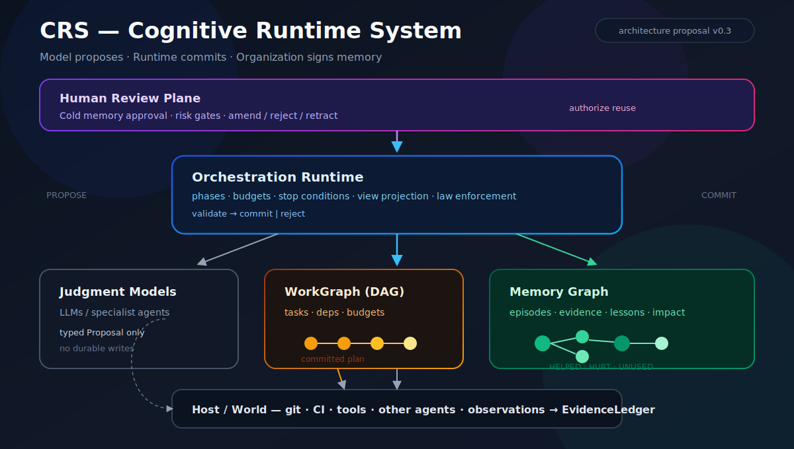

# CRS — Cognitive Runtime System

**English** · **[Português (Brasil)](README.pt-BR.md)**

**Orchestration with laws. Memory as a graph. Humans as reviewers of what the organization is allowed to remember.**

> CRS is not “yet another multi-agent framework.”  
> It is an **architecture proposal**: the work cycle and the memory cycle are a **program** (runtime); the LLM only **proposes**; commits to state and memory are **governed**.

[](LICENSE)

---

## Cover diagram



*Model proposes → runtime validates and commits → organization signs what may be remembered.*

---

## The idea in plain language

Most multi-agent systems today treat the model as the *mind* of the system:

- the model plans  
- the model decides when to call tools  
- the model “remembers” via chat history or embeddings  
- humans either approve every action or disappear from the loop  

That works for demos. It breaks in organizations.

**CRS starts from a different bet:**

| What feels like “intelligence” | Who should own it in CRS |
|---|---|
| Judging under uncertainty | **Model** (LLM / agent) — *proposal only* |
| Process, limits, stop conditions | **Runtime** — *laws in code* |
| What the company reuses next week | **Memory Graph** + **human review** |
| Acting on the world (git, CI, APIs) | **Host** — tools and side effects |

In one sentence:

> **The model proposes. The runtime commits. The organization signs what it remembers.**

That is the whole idea. Everything else is structure around it.

---

## TL;DR

**CRS (Cognitive Runtime System)** is an architecture for multi-agent orchestration:

1. **Runtime owns control** — phases, budgets, DAGs, stop conditions  
2. **Models only propose** — they never silently mutate durable state  
3. **Work is a DAG** — explicit dependencies, parallelism, no cycles  
4. **Memory is a graph** — episodes, lessons, evidence, impact edges  
5. **Humans review memory** — not every keystroke; the *beliefs* the org reuses  

**Moat thesis:** commodity judgment models + proprietary orchestration + governed organizational memory.

Big labs scale **judgment**.  
Operators need to scale **process** and **owned memory**.

---

## The problem we are solving

### 1. Swarm without structure

“Run five agents” is easy. Coordinating them is not.

Without a real work plan:

- agents redo the same work  
- nobody knows what is blocked vs ready  
- parallel work collides  
- the run never cleanly ends  

CRS treats work as a **DAG** (directed acyclic graph): tasks with dependencies, clear frontiers, and a terminal state.

### 2. Memory without ownership

Today “agent memory” is often:

- a long context window  
- a vector store of similar text  
- a chat log treated as truth  

None of those answer:

- *Who approved this as company knowledge?*  
- *What evidence supports it?*  
- *Did reusing it help or hurt?*  
- *What supersedes it now?*  

Without ownership, multi-agent systems scale **rumor** at the same speed they scale productivity.

### 3. Human-in-the-loop in the wrong place

Approving every tool call is expensive. People abandon it.

Ignoring humans entirely is worse: bad lessons harden into “how we work here.”

CRS moves humans to the **leverage point**:

- not every keystroke  
- **canonical memory** and **real risk gates**

**Code review** improves today’s artifact.  
**Memory review** improves tomorrow’s organization.

---

## How CRS thinks about a run

```text
goal
  → model proposes a plan
  → runtime validates & commits a DAG          ← plan becomes official
  → swarm executes ready nodes in parallel
  → host returns evidence (tests, logs, diffs)
  → model proposes lessons / merges / replans
  → verifier and/or human reviews memory
  → runtime commits cold memory                 ← only what may be reused
  → next goal retrieves memory with a budget
  → impact edges: HELPED / HURT / UNUSED
```

### Proposal vs commit (the heart of CRS)

This is the most important distinction in the whole design.

| Step | Who | Meaning |
|---|---|---|
| **Propose** | Model | “I think the plan / lesson / merge should be X” |
| **Validate** | Runtime | Check laws: no cycles, budget, schema, constraints |
| **Commit** | Runtime | Make it **durable official state** |
| **Reject** | Runtime / human | Keep history; do not promote garbage |

Analogy with git:

| Git | CRS |
|---|---|
| working tree edits | model proposal |
| `git commit` | runtime **commit** (DAG or memory) |
| history | auditable WorkGraph + MemoryGraph |

If the model can write “truth” alone, you do not have a cognitive runtime.  
You have a monologue with side effects.

---

## Why a graph for memory (not only RAG)

RAG answers: *“what text looks similar to this question?”*  
Orchestration needs: *“what did we try, what worked, who vetoed what, and what should never happen again?”*

That needs **structure, time, and causality**.

| Node examples | Edge examples |
|---|---|
| Episode, Evidence, Belief, Lesson | `SUPPORTS`, `DERIVED_FROM` |
| Task, Agent, Artifact | `EXECUTED_BY`, `PRODUCED` |
| HumanDecision | `REVIEWED_BY`, `SUPERSEDES` |
| | `HELPED` / `HURT` / `UNUSED` |

**Logging ≠ learning.**  
Learning = persistent change that improves future decisions **with evaluation**.

### Three memory planes

| Plane | What lives there | Write path |
|---|---|---|
| **Hot** | this task’s state | free under the runtime |
| **Warm** | candidate lessons/beliefs | agents propose |
| **Cold** | canonical organizational memory | human and/or formal verifier |

Agents may be prolific in **warm**.  
**Cold** is scarce, reviewed, and scoped (repo, team, environment).

---

## A concrete walkthrough

Imagine the goal: *“Fix failing auth tests after a schema change.”*

1. **Frame** — runtime loads constraints and cold lessons for this repo.  
2. **Plan proposal** — model suggests: recon → fix migration → fix tests → open PR.  
3. **DAG commit** — runtime accepts the plan (or rejects a cyclic / over-budget plan).  
4. **Spawn** — recon runs; when done, fix tasks become `ready`.  
5. **Observe** — CI fails; evidence is attached to the node.  
6. **Critique / replan** — model proposes a patch to the DAG; runtime commits or rejects.  
7. **Consolidate** — model proposes a lesson:  
   *“After schema changes, run migrate + typecheck before opening a PR.”*  
8. **Memory review** — human (or CI-backed verifier policy) accepts, edits, or rejects.  
9. **Next week** — a similar goal retrieves that lesson in the view.  
   If an agent tries to skip it, the **runtime can block** — the model does not need to “remember to be careful.”

That last sentence is the product difference:

> Rigor where code can enforce it.  
> Judgment where uncertainty remains.

---

## Architecture (overview)

```text
┌──────────────────────────────────────────────────────┐
│  Human Review Plane                                  │
│  approve / amend / reject memory and risk gates      │
└───────────────────────────┬──────────────────────────┘
┌───────────────────────────▼──────────────────────────┐
│  CRS Orchestration Runtime                           │
│  phases · budgets · authority · stop conditions      │
└───────┬─────────────────────────────┬────────────────┘
        │ proposals                   │ commits
┌───────▼──────────┐         ┌────────▼────────┐
│ Judgment layer   │         │ Durable state   │
│ LLMs / agents    │         │ WorkGraph (DAG) │
│ (stateless I/O)  │         │ MemoryGraph     │
└───────┬──────────┘         │ EvidenceLedger  │
        │                    └────────▲────────┘
┌───────▼──────────┐                  │
│ Host / World     │ observations ────┘
│ git, CI, tools,  │
│ other agents     │
└──────────────────┘
```

### Formula

```text
CRS =
  OrchestrationRuntime      # laws, phases, budgets
+ WorkGraph                 # committed task DAG
+ MemoryGraph               # causal organizational memory
+ EvidenceLedger            # what can be verified
+ JudgmentModels            # LLMs / agents (propose only)
+ HumanReviewPlane          # cold memory + risk gates
```

### Authority in one table

| Actor | May | Must not |
|---|---|---|
| **JudgmentModel** | emit typed proposals | mutate durable state alone |
| **Runtime** | validate, reject, commit; change phase | treat free-form prose as commit |
| **Host** | execute tools; return observations | write cold memory outside runtime APIs |
| **Human** | review memory; mediated override; halt | silently bypass audit |

Deeper docs: [thesis](docs/00-thesis.md) · [architecture](docs/01-architecture.md) · [DAG](docs/02-orchestration-dag.md) · [memory graph](docs/03-memory-graph.md) · [human review](docs/04-human-memory-review.md) · [authority contracts](docs/05-authority-contracts.md)

---

## How this differs from common approaches

| Approach | Strength | Gap CRS targets |
|---|---|---|
| Single chat agent | simple UX | no durable org process/memory |
| Multi-agent prompt swarms | parallelism | weak authority; rumor memory |
| Workflow tools (graphs of steps) | reliable pipelines | often no belief/memory governance |
| RAG over docs | cheap retrieval | similarity ≠ approved operational truth |
| Fine-tuning a company model | style/knowledge in weights | opaque, slow, hard to retract |
| Human approves every action | safe feeling | does not scale; wrong leverage point |

CRS can sit **on top of** existing model APIs, agent CLIs, and workflow engines.  
The point is the **type of system** (authority + governed memory), not a single library brand.

---

## What CRS is **not**

- Not AGI, consciousness, or a claim that graphs “create minds”  
- Not a claim that smaller models beat frontier models at raw judgment  
- Not “LangGraph with a new name” — the differentiator is **who may commit what**  
- Not human approval on every tool call — humans own **cold memory** and real risk  
- Not infinite ontology theater — start with situated, scoped, impact-measured memory  

---

## Principles (non-negotiable)

1. **Control and invariants are code** — they are not sampled by the network.  
2. **Work and memory are mutable state** — not only prose in context.  
3. **Growth requires evaluated experience** — logging ≠ learning.  
4. **Durable belief requires provenance** — and, when policy requires it, review.  
5. **Finite budget** — a swarm without a ceiling is a loop, not intelligence.

---

## Status

This repository publishes the **architecture proposal** (concept, contracts, schemas).

| Layer | Status |
|---|---|
| Thesis and contracts | v0.3 (this repo) |
| JSON schemas (WorkGraph / MemoryGraph / Proposal) | draft in [`schemas/`](schemas/) |
| Reference runtime (implementation) | planned |
| Integration with real swarms (e.g. coding agents) | planned |

### Documentation map

| Doc | Topic |
|---|---|
| [docs/00-thesis.md](docs/00-thesis.md) | Why this bet exists |
| [docs/01-architecture.md](docs/01-architecture.md) | Components and end-to-end flow |
| [docs/02-orchestration-dag.md](docs/02-orchestration-dag.md) | Work DAG and plan commit |
| [docs/03-memory-graph.md](docs/03-memory-graph.md) | Graph memory model |
| [docs/04-human-memory-review.md](docs/04-human-memory-review.md) | Humans as memory governors |
| [docs/05-authority-contracts.md](docs/05-authority-contracts.md) | Normative authority rules |

Portuguese: [README.pt-BR.md](README.pt-BR.md) · [docs/pt-BR/](docs/pt-BR/)

---


## FAQ

### Is CRS a product, a library, or a paper?

It is an **architecture proposal**: principles, contracts, schemas, and a reference shape for multi-agent systems. A reference runtime is planned; the normative core is the authority and memory model, not a single package name.

### How is this different from LangGraph / CrewAI / AutoGen / “agent swarms”?

Those tools are useful **workflow muscles**. CRS asks a sharper question: **who is allowed to commit durable state?**  
If the model can write plans and organizational “truth” without validation, provenance, and promotion rules, you have orchestration *syntax* without cognitive *authority*. CRS can be implemented on top of many runtimes; the type is the point.

### Do humans have to approve every agent action?

No. That pattern does not scale.  
In CRS, humans concentrate on:

1. **Cold memory** — what the organization may reuse  
2. **Real risk gates** — production, security, irreversible actions  

Hot-path tool use stays under runtime policy and budgets.

### Why a graph instead of vector memory / RAG?

RAG is great for “similar text.” Orchestration needs causal questions: what we tried, what evidence supported it, who approved it, whether reuse helped or hurt, and what supersedes it.  
Vectors can still index nodes; they are not a substitute for **owned, linked, evaluable memory**.

### What is a DAG commit in one sentence?

The model *suggests* a task plan; the runtime *makes that plan official durable state* only after law checks (no cycles, budget, owners, constraints). Without commit, a plan is conversation.

### Can a small model work with CRS?

Often better than people expect **for process-shaped work**, because rigor lives in the runtime.  
Raw judgment quality still depends on the model: CRS raises honesty and reuse discipline; it does not magically create domain genius.

### What stops the swarm from running forever?

Explicit **budgets and stop conditions**: max children, replan rounds, wall-clock, cost, candidate memory writes. Exhausted budget → `stop` with a reason. A swarm without a ceiling is a cost loop.

### What does “logging ≠ learning” mean?

Writing text into a store is not learning.  
CRS treats learning as: episode + evidence + memory state change + later impact (`HELPED` / `HURT` / `UNUSED`). Accumulation without evaluation must not be reported as success.

### Is this claiming AGI?

No. CRS is an **architecture for reliable multi-agent work and organizational memory**. It is a counterweight to “scale the monologue,” not a consciousness thesis.

### Where should I start reading?

1. This README (idea + walkthrough)  
2. [Authority contracts](docs/05-authority-contracts.md)  
3. [Memory graph](docs/03-memory-graph.md)  
4. [Human memory review](docs/04-human-memory-review.md)

### Can I implement only part of CRS?

Yes. A useful partial adoption path:

1. Proposal vs commit for plans (WorkGraph)  
2. Budgets and stop conditions  
3. Evidence-linked lessons (warm)  
4. Human promotion to cold memory  

Full conformance needs all six components in the formula, but incremental value starts at step 1.


## Contributing / discussion

Issues and discussions are welcome — especially on:

- memory schemas and cold-promotion policies  
- `HELPED` / `HURT` / `UNUSED` metrics that survive contact with production  
- real-world Memory Reviewer roles (who owns the runbook?)  
- stop conditions and budget designs that do not kill productive work  

---

## License

MIT — see [LICENSE](LICENSE).

---

## Short citation

> The model is commodity.  
> Orchestration with laws and governed organizational memory are the moat.
